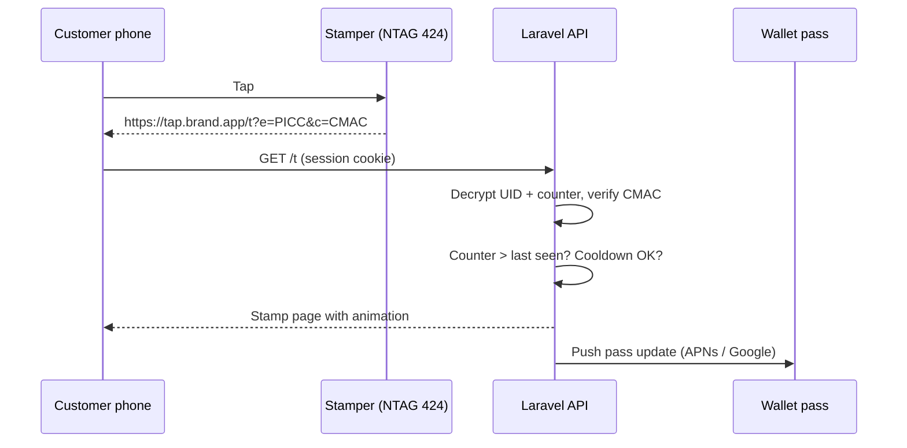
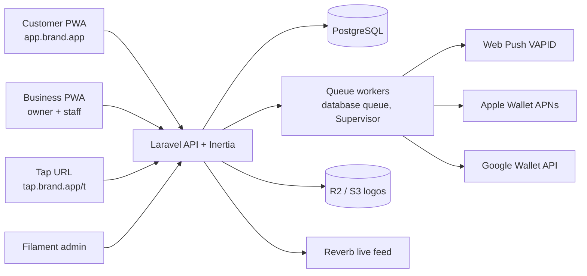
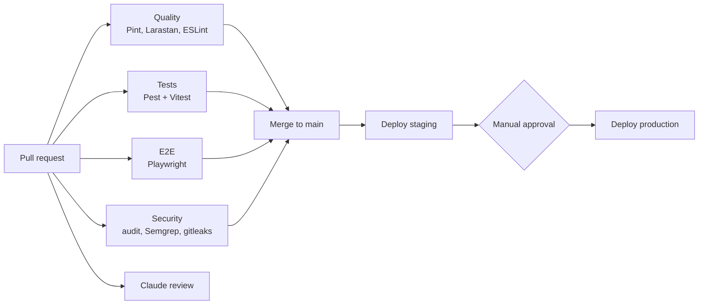

<!-- Exported from the "PunchPass Clone" research doc (claude.ai) on 2026-09-29. Product codename: punchcard.
     "PunchPass" below refers to the Australian competitor that inspired the product, not to this app. -->

# punchcard: product spec, research and design prompts

> Working codename: **punchcard**. Wherever the prompts say `[BRAND]`, use punchcard until a final brand is chosen.

Sep 23, 2026 · @ahmed chioua

## Verdict

Buildable in about 8 to 10 weeks for one developer, but the software is the easy part. PunchPass wins on a passive NFC stamper on the counter plus a done-for-you kit; a clone without an equivalent tap experience is just another stamp-card app competing with Wallio (already selling the same model in Morocco), Stamp Me, Square Loyalty and dozens of others.

Four things to decide before writing code:

1. **iOS has no Web NFC.** A PWA cannot read NFC tags on iPhone. The fix is a tag that stores a URL: iPhones read NDEF tags natively from the lock screen and open the link, so the "app" becomes a web page the tap opens. Section 4 covers it.
2. **Static tags are trivially forgeable.** If the tag holds a fixed URL, anyone who copies it can stamp from home forever. Use NTAG 424 DNA tags with SUN (Secure Unique NFC) so every tap produces a one-time signed URL the Laravel backend verifies. Cost is roughly USD 1 to 2 per tag.
3. **Web push on iOS only works after "Add to Home Screen".** Most café customers will not install a PWA. Ship Apple Wallet and Google Wallet passes as the primary card (PunchPass itself says stamps land in the wallet), and treat the PWA as the account and history layer. Wallet pass updates also give you free lock-screen notifications.
4. **Do not reuse the name or copy.** "PunchPass" is already used by this Australian company and by an unrelated US studio-booking SaaS (punchpass.com). Pick your own brand, write your own marketing, and design your own UI.

Fit check: this is a side-income SaaS play. It moves you toward revenue only if you have a first market and 5 to 10 cafés willing to pilot (Tétouan and Tangier cafés are an obvious test bed, but Wallio already sells wallet and NFC/QR loyalty in Morocco at 250 to 349 DH/month; see the competitor section and compete on verified taps and chains, not price). Without pilots lined up, build the MVP in section 10 only, not the full feature set.

## What PunchPass is

PunchPass (PunchPass Pty Ltd, Brisbane) is a digital stamp-card system for cafés and other repeat-visit businesses: the customer taps their phone on a battery-free NFC stamper and a stamp lands on their digital card. It claims 400+ Australian businesses and about 353,000 stamps issued ([offer page](https://offer.punchpass.app/)).

**Three sides of the product**

- **Customer app** (iOS and Android, native): one account, many cafés, tap to collect, rewards, map of participating venues ([App Store](https://apps.apple.com/au/app/punchpass/id6743117538), [Google Play](https://play.google.com/store/apps/details?id=app.punchpass.rewards&hl=en_AU)).
- **Owner portal** (web, [portal.punchpass.app](https://portal.punchpass.app/)): card setup, customer dashboard, push notifications, billing.
- **Hardware kit**: a wax-seal style stamper with an NFC chip in the base, a counter display stand with a QR code for app download, branded box. No power, no screen.

**Target customers**: cafés first, then beauty salons, barbers, restaurants, nail franchises (Wills Nails runs it on 10+ sites), car washes.

**Pricing** (AUD, from [punchpass.app](https://www.punchpass.app/) and the [offer page](https://offer.punchpass.app/))

| Plan                          | Annual billing | Monthly billing | Main inclusions                                                                                                                |
| ----------------------------- | -------------- | --------------- | ------------------------------------------------------------------------------------------------------------------------------ |
| Pro / Loyalty Tools           | 25/mo          | 35/mo           | Unlimited staff users, admin portal, card customisation, basic insights, 1 location + 1 card                                   |
| Premium / Loyalty & Marketing | 39/mo          | 55/mo           | Everything in Pro + unlimited push, custom-colour stamper and card, advanced insights, onboarding, done-for-you first campaign |
| Enterprise                    | Quote          | Quote           | Custom app, unlimited locations and cards, custom analytics                                                                    |
| Add-on                        | 20/mo          | 20/mo           | Each extra location or loyalty card                                                                                            |

Go-to-market: 30-day free trial, free starter kit (customer pays 15 AUD shipping), 60-day money-back and a "200 return taps" guarantee. Marketing leans on outcome claims (3.1 visits per customer, 68% return rate, 120 AUD revenue per 100 customers notified); treat those as their marketing, not verified data.

## Competitor: Wallio (Morocco)

Wallio already sells almost exactly this architecture in Morocco: a PWA plus Apple and Google Wallet cards, stamped from a counter card with a static QR code and an optional NFC tag, at 250 to 349 DH/month ([site](https://app.walliocard.com/)). It is run by a solo auto-entrepreneur in Agadir, built on Vercel and Google Firebase (US hosting), with legal pages dated September 2026, one visible client logo, and sign-up only via WhatsApp ([legal notice](https://app.walliocard.com/legal)).

| Area                              | Wallio                                                                                          | This spec                                                    | Edge      |
| --------------------------------- | ----------------------------------------------------------------------------------------------- | ------------------------------------------------------------ | --------- |
| Card surface                      | Apple and Google Wallet + PWA                                                                   | Same                                                         | Tie       |
| Stamping                          | Static QR on counter, optional static NFC tag                                                   | Signed NTAG 424 tag (one-time URL) + staff-scanned member QR | This spec |
| Proof of presence                 | None visible; a photo of the QR works from home, only a cooldown (15 min to 1 day) limits abuse | Every tap unique, replay rejected                            | This spec |
| Identification                    | First name + phone number, no OTP shown                                                         | Apple, Google, magic link, passkey                           | This spec |
| Redemption                        | Owner validates from dashboard                                                                  | Tap or staff scan at counter                                 | This spec |
| Staff counter mode                | Not shown                                                                                       | S1 with multi-stamp arming                                   | This spec |
| Reward models                     | Cyclic + progressive tiers, 5 to 50 stamps                                                      | Cyclic only (now adding tiers)                               | Wallio    |
| Card design                       | 8 stamp styles, banner image, info fields                                                       | Colours, logo, icon (now adding)                             | Wallio    |
| Referral program                  | +1 stamp for referrer                                                                           | Now added                                                    | Wallio    |
| Geofenced notifications           | Yes                                                                                             | Now added via wallet pass locations                          | Wallio    |
| Directory                         | By category and city                                                                            | Discover map                                                 | Tie       |
| Birthday and win-back automations | Yes                                                                                             | Yes                                                          | Tie       |
| Multi-location, chains            | Not mentioned                                                                                   | Built in                                                     | This spec |
| Onboarding                        | WhatsApp, manual                                                                                | Self-serve wizard + trial                                    | This spec |
| Hardware cost                     | Zero, printable QR card                                                                         | Stamper kit 10 to 15 USD (QR-only tier possible)             | Wallio    |
| Data compliance                   | US hosting, cites GDPR only, no Law 09-08 / CNDP mention                                        | EU or Moroccan hosting, CNDP declaration                     | This spec |

Wallio's "push without installation" claim does not hold on iPhone, where web push needs a home-screen install; in practice it relies on Wallet pass updates.

**Positioning against it**

- Lead with fraud: "every stamp is proven at the counter". A static QR lets regulars stamp from home once per cooldown, which is free coffees given away.
- Target chains and franchises (5 to 20 sites) where multi-location, staff roles, self-serve onboarding and data compliance matter. One chain beats 20 single cafés.
- Offer a QR-only entry tier (member QR scanned by staff, zero hardware) to match Wallio's zero hardware cost, and upsell the verified stamper.
- Price near the 250 to 349 DH/month anchor; do not try to undercut once payment fees are added.
- Prefer a distribution partner that already sells to many shops (for example a bakery or café supplier) over selling café by café.

## Feature inventory

Every feature PunchPass publicly shows, plus the ones any clone needs to actually run. "Source" says whether it is confirmed on their site or store listings, or a required addition for your build.

**Customer side (PWA + wallet pass)**

| Feature                        | Detail                                                                                                             | Source                                             |
| ------------------------------ | ------------------------------------------------------------------------------------------------------------------ | -------------------------------------------------- |
| Sign up once                   | Email, Google, Apple (Facebook listed in terms); minimum age 16; name, email, optional DOB and phone               | Confirmed                                          |
| Tap to stamp                   | Tap phone on stamper, stamp added instantly                                                                        | Confirmed                                          |
| Multiple stamps per tap        | Staff sets a count, e.g. 2 coffees = 2 stamps                                                                      | Confirmed (app update notes)                       |
| Cards across venues            | One account holds cards from every participating business                                                          | Confirmed                                          |
| Progress view                  | Stamps collected vs needed per card                                                                                | Confirmed                                          |
| Reward redemption              | Full card unlocks reward, staff confirms at counter                                                                | Confirmed                                          |
| Wallet card                    | Stamp shows in Apple or Google Wallet                                                                              | Confirmed (offer FAQ)                              |
| Venue map / discovery          | Map of nearby participating venues, location-based                                                                 | Confirmed                                          |
| Rewards Centre                 | Promotions, active programs, vouchers in one place                                                                 | Confirmed (terms)                                  |
| Push notifications             | Promos from businesses the customer follows                                                                        | Confirmed                                          |
| Reviews                        | Customers can review businesses                                                                                    | Confirmed (terms)                                  |
| Birthday bonus                 | Auto bonus stamps on birthday                                                                                      | Addition (DOB is collected; competitors ship this) |
| Account deletion + data export | Required by app stores and privacy law                                                                             | Addition                                           |
| Refer a friend                 | Share a unique link per card; friend gets first stamp on sign-up, referrer gets +1 stamp and a wallet update       | Addition (Wallio has it)                           |
| Nearby reminder                | Wallet pass relevant locations surface the card on the lock screen near the venue ("2 stamps to your free coffee") | Addition (Wallio has it)                           |

**Owner portal**

| Feature               | Detail                                                                                                                                         | Source                            |
| --------------------- | ---------------------------------------------------------------------------------------------------------------------------------------------- | --------------------------------- |
| Business onboarding   | Account, business details, logo, verification (ID, address)                                                                                    | Confirmed                         |
| Card builder          | Stamps required, reward text, logo, colours, live preview; edit anytime from phone                                                             | Confirmed                         |
| Reward types          | Free item, % off, fixed discount, dollar-based rewards                                                                                         | Confirmed                         |
| Multiple cards        | E.g. coffee card + food card; extra cards are a paid add-on                                                                                    | Confirmed                         |
| Bonus stamps          | Extra stamps for food purchases, limited-time promos                                                                                           | Confirmed                         |
| Promotions            | Time-limited deals, BOGO, fixed-price offers with terms                                                                                        | Confirmed                         |
| Customer dashboard    | Every regular by name, visit count, last visit, "going quiet" list, top 10                                                                     | Confirmed                         |
| Stats                 | Stamps given, rewards redeemed, visits chart, estimated revenue                                                                                | Confirmed (dashboard screenshots) |
| Push campaigns        | Send to all or a segment (e.g. not seen in 14 days) in two taps                                                                                | Confirmed                         |
| Marketing automation  | Premium plan: automated win-back sends                                                                                                         | Confirmed (plan list)             |
| Unlimited staff users | Staff logins with limited rights                                                                                                               | Confirmed                         |
| Manual stamp via QR   | For phones without NFC: staff scans customer QR and adds stamps                                                                                | Confirmed                         |
| Multi-location        | Per-location stampers and stats; extra location add-on                                                                                         | Confirmed                         |
| Subscription billing  | Trial, monthly/annual, upgrade (prorated) and downgrade (next cycle), cancel at period end                                                     | Confirmed (terms)                 |
| Stamper management    | Register, rename, disable a lost stamper                                                                                                       | Addition                          |
| Fraud controls        | Cooldown per customer per card, daily cap, anomaly alerts                                                                                      | Addition                          |
| CSV export            | Customer list and stamp history                                                                                                                | Addition                          |
| Progressive tiers     | Lifetime stamps never reset; each tier unlocks a different reward (e.g. 5 = 10% off, 10 = free item, 20 = VIP). Alternative to the cyclic card | Addition (Wallio has it)          |
| Card design extras    | 5 to 50 stamps, several stamp styles (dot, ring, check, heart, star, logo), banner image, info fields (hours, phone, links)                    | Addition (Wallio has it)          |
| Referral settings     | Turn referrals on or off, stamps for referrer and friend, monthly cap per customer                                                             | Addition                          |
| QR-only plan          | No stamper; staff scan the customer's wallet member QR. Entry tier with zero hardware cost, upsell to the verified stamper                     | Addition                          |
| Brand settings        | Organization logo, brand colour and cover applied to cards, tap screens, Wallet passes, push titles and email sender name (ADR 0007)           | Addition                          |
| Franchise networks    | One card program shared by franchisees who each pay and run their own sites; HQ console, per-site attribution report (ADR 0006)                | Addition                          |
| White-label           | Enterprise add-on: custom domain, the brand's own PWA name and icon, themed app chrome, branded email (ADR 0007)                               | Addition                          |

**Platform admin (you)**

| Feature                     | Detail                                        | Source                   |
| --------------------------- | --------------------------------------------- | ------------------------ |
| Business verification queue | Approve or reject new businesses              | Confirmed (terms)        |
| Offer moderation            | Remove illegal or offensive offers            | Confirmed (terms)        |
| Hardware fulfilment         | Kit orders, shipping status, tag provisioning | Confirmed (kit shipping) |
| Plans and coupons           | Manage plans, trials, discounts               | Addition                 |
| Impersonation + audit log   | Support a business safely                     | Addition                 |

## Tap-to-stamp on a PWA

Use a URL-based NFC tag, not Web NFC. The stamper holds an NTAG 424 DNA chip configured for SUN (Secure Dynamic Messaging); each tap makes the chip emit a URL with an encrypted tap counter and a CMAC signature, the phone opens it in the browser, and Laravel verifies and stamps. This works on iPhone XS and newer and on any NFC Android phone, with no app open and no battery in the stamper.



The server rejects any URL whose counter is not higher than the last one stored for that tag, so a copied or screenshotted link is worthless.

**Platform behaviour to design around**

| Case                   | What happens                                                                                              | Design response                                                                                                                  |
| ---------------------- | --------------------------------------------------------------------------------------------------------- | -------------------------------------------------------------------------------------------------------------------------------- |
| iPhone, first tap      | Lock-screen banner opens the URL in Safari                                                                | Page shows "Join \[café\]" with Sign in with Apple, Google or email magic link, then applies the stamp                           |
| iPhone, PWA installed  | Tag URL still opens in Safari, not the home-screen app; Safari and the installed PWA do not share cookies | Keep a long-lived Safari session (passkey or magic link, 1-year remember token). Do not depend on the installed PWA for stamping |
| Android, PWA installed | Chrome can open in-scope links in the installed WebAPK                                                    | Set `scope` and `start_url` so /t is in scope                                                                                    |
| Android in-app scan    | Chrome Android supports Web NFC (`NDEFReader`)                                                            | Optional "Scan" button inside the PWA; never the only path                                                                       |
| Phone without NFC      | No tap possible                                                                                           | Customer shows a rotating QR (member ID + 30 s TOTP) in the PWA or wallet pass; staff scans it in the staff PWA                  |
| Multiple stamps        | Tag cannot know the order size                                                                            | Staff sets "next tap = 3 stamps" in the staff PWA, armed on that stamper for 60 s                                                |
| Redeem reward          | Needs presence proof                                                                                      | Customer taps Redeem, then taps the stamper (or staff confirms by scanning the customer QR); reward marked used server-side      |

**Anti-fraud rules (configurable per card)**

- Counter must increase per tag (replay protection).
- Cooldown per customer per card, default 20 minutes.
- Daily cap per customer per business, default 5 stamps.
- Flag accounts with taps at many venues within minutes, or on disabled stampers.
- Owner can disable a lost stamper instantly; you ship a replacement with new keys.

**Tag provisioning**: each tag gets a unique AES key (derived from a master key plus UID, per NXP AN10922; SUN message format per AN12196), written with a USB NFC writer (for example ACR1252U) and the free NXP TagXplorer tool, then registered to a business in your admin. The verification itself is about 60 lines of PHP using `openssl_decrypt` (AES-128) plus an AES-CMAC function. Budget: tag 1 to 2 USD, 3D-printed or resin stamper body 3 to 8 USD in small batches.

**Cheaper MVP option**: plain NTAG213 stickers with a static URL plus a rotating 4-digit code on a counter card. Much weaker security; only use it for a pilot with friendly cafés.

## Architecture

One Laravel monolith with Inertia (React or Vue) serving three installable PWAs from one codebase: customer, business (owner + staff), and a Filament super-admin. A monolith keeps session-cookie auth simple for the tap flow and is the fastest path for a solo build.



Workers handle every slow call (pass updates, push fan-out) so the tap response stays under 300 ms.

| Concern       | Choice                                                                                                                                                   | Why                                                                                                                   |
| ------------- | -------------------------------------------------------------------------------------------------------------------------------------------------------- | --------------------------------------------------------------------------------------------------------------------- |
| Framework     | Laravel (current major), PHP 8.3+                                                                                                                        | Your stack; queues, auth, scheduler built in                                                                          |
| Frontend      | Inertia + React (or Vue) + Tailwind, `vite-plugin-pwa` (Workbox)                                                                                         | One repo, SSR-free SPA feel, service worker and manifest generated                                                    |
| Auth          | Sanctum session cookies, Socialite (Google, Apple), email magic links, passkeys (`spatie/laravel-passkeys` or WebAuthn)                                  | Long-lived Safari session for iOS taps                                                                                |
| Roles         | `spatie/laravel-permission`: customer, staff, owner, admin                                                                                               | Staff can stamp and redeem, not see billing                                                                           |
| Tenancy       | Single DB; organization → business → location; `organization_id` and `business_id` columns + global scopes (ADR 0006)                                    | Customers span many brands; franchises share one card across businesses; per-tenant DBs would break both              |
| Web push      | `laravel-notification-channels/webpush` (VAPID)                                                                                                          | Android and installed iOS PWAs                                                                                        |
| Wallet passes | Apple: `.pkpass` via a PHP pass library + the Apple pass web service endpoints; Google: `google/apiclient` Wallet Objects (loyaltyClass / loyaltyObject) | Primary card surface; updates show on lock screen                                                                     |
| Queues, cache | `database` drivers for queue, cache, sessions and rate limits; Redis + Horizon only when ADR 0005's triggers hit                                         | One less service for the pilot; switching is an `.env` change                                                         |
| Realtime      | Laravel Reverb                                                                                                                                           | Live "stamp just landed" feed on the staff screen                                                                     |
| Billing       | Laravel Cashier (Stripe) or Cashier Paddle                                                                                                               | Stripe does not onboard Moroccan companies directly; Paddle acts as merchant of record, so check which fits Bangicode |
| Maps          | Leaflet + OpenStreetMap, PostGIS or simple lat/lng radius                                                                                                | No per-load map fees                                                                                                  |
| Admin         | Filament                                                                                                                                                 | Verification queue, tags, plans in days not weeks                                                                     |
| Analytics     | SQL aggregates + nightly rollup table                                                                                                                    | Dashboard loads fast without a BI tool                                                                                |
| Hosting       | Hetzner + Ploi, Cloudflare in front, R2 storage                                                                                                          | Low cost; Laravel Cloud if you prefer managed                                                                         |

**PWA specifics**: separate manifests per surface (different name, icon, `start_url`, `scope`); offline shell with the last-known cards cached in IndexedDB; install prompt shown after the second stamp, not on first visit; iOS install instructions sheet because Safari has no install prompt.

## Data model and API

Nineteen tables cover the whole product; `stamp_events` is the source of truth and every count on the dashboard derives from it.

| Table                 | Key columns                                                                                                                                                                                                                               | Notes                                                                                              |
| --------------------- | ----------------------------------------------------------------------------------------------------------------------------------------------------------------------------------------------------------------------------------------- | -------------------------------------------------------------------------------------------------- |
| users                 | id, name, email, phone, dob, locale, marketing\_opt\_in                                                                                                                                                                                   | One row per person; role via permissions                                                           |
| organizations         | id, name, slug, type (independent/chain/franchise), logo\_path, brand\_color, cover\_path, billing\_entity (organization/business), plan, white\_label (bool)                                                                             | Brand and card program owner (ADR 0006)                                                            |
| organization\_user    | organization\_id, user\_id, role (org\_admin)                                                                                                                                                                                             | Franchise HQ membership                                                                            |
| organization\_domains | organization\_id, host, verified\_at, tls\_status                                                                                                                                                                                         | Enterprise white-label only (ADR 0007)                                                             |
| businesses            | id, organization\_id, name, slug, category, status (pending/verified/suspended), plan                                                                                                                                                     | Site-level tenant (a franchisee); owners are `business_user` rows with role owner                  |
| locations             | id, organization\_id, business\_id, name, address, lat, lng, timezone                                                                                                                                                                     | Map pins                                                                                           |
| business\_user        | business\_id, user\_id, role (owner/staff), location\_id                                                                                                                                                                                  | Staff membership                                                                                   |
| loyalty\_cards        | id, organization\_id, name, stamps\_required, mode (cyclic/progressive), tiers (json), stamp\_style, banner\_path, reward\_type (item/percent/fixed), reward\_value, reward\_text, colors, icon, terms, cooldown\_min, daily\_cap, active | The card template, owned by the organization; `card_business` pivot lists participating businesses |
| card\_enrollments     | id, card\_id, user\_id, referred\_by, referral\_code, current\_stamps, lifetime\_stamps, completed\_count, last\_stamp\_at                                                                                                                | A customer's copy of a card                                                                        |
| stamp\_events         | id, enrollment\_id, business\_id, location\_id, stamper\_id, staff\_id, qty, source (nfc/qr/manual/bonus/birthday), ip, ua, created\_at                                                                                                   | Append-only ledger                                                                                 |
| rewards               | id, enrollment\_id, status (available/redeemed/expired), unlocked\_at, redeemed\_at, redeemed\_by, redeemed\_business\_id, redeemed\_location\_id, expires\_at                                                                            | One per completed card                                                                             |
| nfc\_tags             | id, uid, key\_version, last\_counter, retired\_at                                                                                                                                                                                         | NFC tags: platform state, never deleted; counter and key version only move forward                 |
| stampers              | id, organization\_id, business\_id, location\_id, nfc\_tag\_id, label, status, armed\_qty, armed\_until, unassigned\_at                                                                                                                   | A tag's assignment to a location; one current per tag                                              |
| promotions            | id, business\_id, title, body, type (bogo/percent/fixed/bonus\_stamps), starts\_at, ends\_at, terms, audience                                                                                                                             | Rewards Centre offers                                                                              |
| campaigns             | id, organization\_id, business\_id (null = org-wide), title, body, deep\_link, segment (all/quiet\_14d/top\_10/birthday), scheduled\_at, sent\_count, open\_count                                                                         | Push sends                                                                                         |
| automations           | id, business\_id, trigger (quiet\_days/birthday/reward\_unlocked), config, active                                                                                                                                                         | Premium plan                                                                                       |
| push\_subscriptions   | user\_id, endpoint, keys, device                                                                                                                                                                                                          | Web push                                                                                           |
| wallet\_passes        | enrollment\_id, platform (apple/google), serial, auth\_token, push\_token                                                                                                                                                                 | Pass registry                                                                                      |
| follows               | user\_id, organization\_id, notify                                                                                                                                                                                                        | Who gets which promos                                                                              |
| reviews               | user\_id, business\_id, rating, body, status                                                                                                                                                                                              | Moderated                                                                                          |

Plus the `card_business` pivot, Cashier's `subscriptions` tables (billable: organization or business), `kit_orders` (address, status, tracking) and `audit_logs`.

**Core endpoints**

| Method + path                                                                       | Who                      | Does                                                                                   |
| ----------------------------------------------------------------------------------- | ------------------------ | -------------------------------------------------------------------------------------- |
| GET /t?e=&c=                                                                        | Customer (browser)       | Verify SUN, apply cooldown/cap, add stamp(s), create reward if full, return stamp page |
| POST /api/stamps/manual                                                             | Staff                    | Scan customer QR token, add qty stamps                                                 |
| POST /api/stampers/{id}/arm                                                         | Staff                    | Next tap on this stamper gives N stamps for 60 s                                       |
| POST /api/rewards/{id}/redeem                                                       | Customer + tap, or staff | Mark reward used, reset card                                                           |
| GET /api/me/cards                                                                   | Customer                 | Enrollments with progress and rewards                                                  |
| GET /api/me/qr                                                                      | Customer                 | Rotating signed member token                                                           |
| GET /api/venues?lat=&lng=&r=                                                        | Customer                 | Map and list of nearby businesses                                                      |
| POST /api/push/subscribe                                                            | Customer, staff          | Store web push subscription                                                            |
| GET /wallet/apple/{serial}.pkpass                                                   | Customer                 | Download Apple pass                                                                    |
| /v1/devices/... , /v1/passes/...                                                    | Apple                    | Apple Wallet web service (register, updates, log)                                      |
| GET /wallet/google/{enrollment}                                                     | Customer                 | Signed "Save to Google Wallet" JWT link                                                |
| CRUD /api/business/cards, /promotions, /campaigns, /automations, /locations, /staff | Owner                    | Portal management                                                                      |
| GET /api/business/customers?segment=                                                | Owner                    | Regulars list with visits, last visit, status                                          |
| GET /api/business/stats?range=                                                      | Owner                    | KPIs and charts                                                                        |
| GET /api/business/export                                                            | Owner                    | CSV of customers and stamps                                                            |
| CRUD /api/org/cards, /businesses, /campaigns, /brand                                | Org admin                | Franchise HQ: shared card program, franchisee invites, org-wide campaigns, brand       |
| GET /api/org/stats?range=&business=                                                 | Org admin                | Network KPIs side by side, stamps earned vs rewards redeemed per franchisee            |

**Derived metrics** (nightly rollup + live for today): active customers (stamped in last 30 days), visits per customer, return rate (customers with 2+ visits / all), quiet customers (no stamp in N days where N = 2 x their average gap, minimum 14), rewards unlocked vs redeemed, estimated revenue (stamps x average ticket the owner enters).

## Organizations, franchises and branding

Decisions in `docs/adr/0006` and `docs/adr/0007`; summary:

- **Three levels, always present**: organization (the brand and its card program) → business (a legal entity that runs sites and may pay) → location (a physical site with stampers). An independent café is an organization with one business, and the UI hides the organization level. An owned chain is one business with many locations. A franchise network is one organization with a business per franchisee.
- **Shared card program**: cards belong to the organization, so a customer's stamps add up across every franchisee. Each stamp and redemption records the business and location, which gives HQ a "stamps earned vs rewards redeemed" report per franchisee. punchcard reports it and does not move money between franchisees.
- **Data inside a franchise**: any participating site sees the customer's progress at the counter; customer lists and marketing audiences for a franchisee only include customers who stamped there; HQ sees every member.
- **Roles**: org\_admin (HQ), owner (one business), staff (optionally one location), customer, admin.
- **Branding on every plan**: logo, brand colour and cover on the card, tap screens, Wallet pass, push titles and email sender name. The app chrome stays punchcard.
- **White-label (Enterprise add-on, Phase 4)**: custom domain with automatic TLS, the brand's own PWA name, icon and theme, branded email. Tag URLs, Wallet issuer accounts, the business portal and Filament stay on punchcard. A white-label PWA is a separate origin: separate sign-in and install, only that brand's cards, and passkeys do not carry over.

## Screen inventory

41 screens across four surfaces; the prompts below reference these IDs. "Brand" is a placeholder for your product name.

| ID  | Surface   | Screen                               | Key content                                                                                            |
| --- | --------- | ------------------------------------ | ------------------------------------------------------------------------------------------------------ |
| C1  | Customer  | Tap landing (first tap, logged out)  | Café logo, "You earned your first stamp", Sign in with Apple / Google / email                          |
| C2  | Customer  | Stamp success                        | Card with new stamp animating in, "3 more to a free coffee", Add to Wallet                             |
| C3  | Customer  | Reward unlocked                      | Confetti, reward name, Redeem now / Save for later                                                     |
| C4  | Customer  | Redeem                               | "Tap the stamper or show this to staff", countdown, QR fallback                                        |
| C5  | Customer  | My cards (home)                      | Stack of cards by recency, progress dots, available rewards badge                                      |
| C6  | Customer  | Card detail                          | Stamp grid, reward, terms, history, venue info, follow toggle                                          |
| C7  | Customer  | Discover map                         | Map pins, bottom sheet list, category chips                                                            |
| C8  | Customer  | Venue page                           | Photos, hours, active cards, promotions, reviews                                                       |
| C9  | Customer  | Rewards Centre                       | Available rewards, promotions, expiring soon                                                           |
| C10 | Customer  | My QR                                | Rotating code for non-NFC phones, brightness hint                                                      |
| C11 | Customer  | Notifications inbox                  | Promos and reward alerts                                                                               |
| C12 | Customer  | Profile + settings                   | Name, birthday, notification toggles, data export, delete account                                      |
| C13 | Customer  | Install / enable notifications sheet | iOS Add to Home Screen steps, Android install button                                                   |
| C14 | Customer  | Onboarding (3 slides)                | Tap, collect, get rewarded                                                                             |
| B1  | Business  | Sign up + plan picker                | Monthly/annual toggle, 2 plans, trial note                                                             |
| B2  | Business  | Onboarding wizard                    | Business info, location, logo, first card, shipping address for kit                                    |
| B3  | Business  | Dashboard                            | KPIs (active customers, visits, return rate, rewards), visits chart, going-quiet list, live stamp feed |
| B4  | Business  | Customers list                       | Search, segments, name, visits, last visit, status chip                                                |
| B5  | Business  | Customer detail                      | Timeline of stamps and redemptions, add stamp manually, notes                                          |
| B6  | Business  | Card builder                         | Form left, live phone preview right; stamps, reward, colours, icon                                     |
| B7  | Business  | Cards list                           | Active and paused cards                                                                                |
| B8  | Business  | Promotions                           | List + create form with dates and terms                                                                |
| B9  | Business  | Push composer                        | Audience segment with size, message, preview on lock screen, schedule                                  |
| B10 | Business  | Campaign results                     | Sent, opened, visits within 48 h                                                                       |
| B11 | Business  | Automations                          | Win-back, birthday, reward reminder toggles                                                            |
| B12 | Business  | Locations + stampers                 | Each stamper with last tap, status, disable                                                            |
| B13 | Business  | Staff                                | Invite by email, role, location                                                                        |
| B14 | Business  | Billing                              | Plan, add-ons, invoices, cancel                                                                        |
| B15 | Business  | Kit order tracking                   | Status steps, tracking number                                                                          |
| B16 | Business  | Settings                             | Business profile, hours, fraud rules (cooldown, cap)                                                   |
| B17 | Business  | Brand settings                       | Logo, brand colour, cover, live preview on card, tap screen and Wallet pass; contrast check            |
| B18 | Business  | Network console (franchise HQ)       | Franchisees list with KPIs side by side, invite a franchisee, shared card, earned vs redeemed report   |
| B19 | Business  | White-label domain (Enterprise)      | Add domain, DNS records to create, verification and TLS status, app name and icon, chrome colours      |
| S1  | Staff     | Counter mode                         | Big buttons: +1, +2, +3 arm stamper; Scan QR; live feed                                                |
| S2  | Staff     | QR scan result                       | Customer name, card progress, add N stamps, redeem reward                                              |
| S3  | Staff     | Redemption confirm                   | Reward, customer, confirm                                                                              |
| A1  | Admin     | Verification queue                   | Pending businesses with documents                                                                      |
| A2  | Admin     | Tag provisioning                     | Register UID, assign to business, key version                                                          |
| A3  | Admin     | Kit orders                           | Fulfilment pipeline                                                                                    |
| A4  | Admin     | Moderation                           | Flagged promotions and reviews                                                                         |
| M1  | Marketing | Landing page                         | Hero, how it works, pricing, FAQ, CTA                                                                  |

A1 to A4 use stock Filament, so they need no design prompt.

## Claude Design prompts

Run these in order in one Claude Design project: prompt 1 sets the design system, the rest reuse it. Claude Design handles multi-screen flows well, so each prompt asks for a group of related artboards. Replace \[BRAND\] with your name before pasting.

**1. Design system**

```text
Create a design system for [BRAND], a tap-to-stamp digital loyalty card platform for independent cafés, salons and barbers. The customer taps their phone on a small NFC stamper at the counter and a stamp lands on their digital card.

Personality: warm, local, a little playful, trustworthy. Think specialty café, not fintech. Must feel simple enough for a 70-year-old regular.

Deliver:
- Color tokens for light and dark: a warm espresso brown primary, a cream background, one bright accent for stamps and rewards (saffron or terracotta), success/warning/error, neutrals. Business brand colors must be able to override the card color only, never the app chrome.
- Type: one rounded humanist sans for UI, one characterful display face for card titles and reward moments. Scale from 12 to 40 px.
- Spacing 4 px grid, radius tokens (cards 20 px, buttons 14 px, chips full).
- Components: primary/secondary/ghost buttons, large 56 px tap targets, input, chips, bottom sheet, tab bar (4 items), top app bar, toast, KPI tile, data table row, status chip (Active, Going quiet, Lost), empty state, and the signature component: the Loyalty Card (logo, business name, stamp grid of 5 to 12 circles, filled stamps shown as ink-stamp marks with slight rotation, reward line, progress text).
- Support LTR and RTL (French, English, Arabic).
Show every component in light and dark.
```

**2. Customer tap flow (mobile 390 x 844)**

```text
Using the [BRAND] design system, design the customer flow that starts when a phone taps the counter stamper. Artboards, left to right:
1. First tap, signed out: café logo and name, headline "Your first stamp is waiting", the loyalty card preview with one stamp ghosted in, buttons Continue with Apple, Continue with Google, Continue with email. Small print: no app download needed.
2. Stamp success: the card with the new stamp landing (show the mid-animation frame, stamp slightly rotated, ink splash), "4 of 10. Six more to a free flat white", buttons Add to Apple Wallet / Add to Google Wallet, secondary link See all my cards.
3. Reward unlocked: celebratory but calm, reward name large, Redeem now and Save for later.
4. Redeem: "Tap the stamper now or show this screen to staff", a 60 second countdown ring, fallback QR below.
5. Cooldown message: "Already stamped 5 minutes ago. Next stamp available at 10:42", friendly, not an error.
Keep text large, one primary action per screen, thumb-reachable buttons.
```

**3. Customer home, card detail, rewards (mobile)**

```text
Design the signed-in customer app for [BRAND] as a PWA with a bottom tab bar: Cards, Discover, Rewards, Profile.
Artboards:
1. Cards home: greeting, a "2 rewards ready" banner, a vertical stack of loyalty cards from different cafés, each with its own brand color and logo, progress dots, last visit date. Empty state for a new user explaining how to tap.
2. Card detail: large card at top, stamp grid, reward and terms, a visit history list, venue address with Open in Maps, Follow for offers toggle, Add to Wallet.
3. Rewards Centre: sections Ready to redeem, Promotions near you, Expiring soon.
4. My QR: full-screen rotating QR with a 30 s refresh indicator and "Use this if your phone has no NFC".
5. Install sheet: bottom sheet explaining Add to Home Screen on iPhone in 3 illustrated steps, and a single Install button variant for Android.
```

**4. Discover (mobile)**

```text
Design Discover for [BRAND]: a map of participating venues with custom pins (cup icon for cafés, scissors for barbers, sparkle for salons), category chips on top, and a draggable bottom sheet listing venues with distance, reward summary ("Free coffee after 8"), and an Offer today badge. Second artboard: venue page with cover photo, hours, the venue's cards, active promotions, star rating and 3 reviews, and a Get directions button.
```

**5. Business dashboard (desktop 1440 and mobile 390)**

```text
Design the [BRAND] business portal dashboard for a café owner who checks it between coffees. Left sidebar: Dashboard, Customers, Cards, Promotions, Push, Automations, Locations, Staff, Billing, Settings.
Main area: date range picker; four KPI tiles (Active customers 312, Visits this month 1,048, Return rate 64%, Rewards redeemed 87) with trend arrows; a visits-per-day bar chart; a Going quiet panel listing 6 regulars with name, usual frequency, days since last visit, and a one-click "Send them a nudge" button; a live feed of stamps as they happen; Top 10 customers.
Also produce the same dashboard adapted to mobile with the sidebar as a bottom tab bar and KPIs as a 2x2 grid.
```

**6. Card builder and push composer (desktop)**

```text
Design two [BRAND] business portal screens.
1. Card builder: form on the left (card name, stamps required as a 5 to 12 stepper, reward type: free item / % off / fixed amount, reward text, card color from 8 swatches or custom, stamp icon picker, logo upload, terms, cooldown minutes, daily cap), and a live phone preview on the right that updates as fields change, with Save and Publish.
2. Push composer: audience picker with segment cards and live counts (All followers 540, Not seen in 14 days 43, Top 10, Birthday this week 6), title and message fields with character counters, optional deep link to a card or promotion, schedule now or later, and an iPhone lock-screen preview of the notification. Show an estimate line: "Sent to 43 people".
```

**7. Staff counter mode (tablet 820 x 1180 and mobile)**

```text
Design [BRAND] staff counter mode for use during a morning rush: huge buttons, high contrast, readable at arm's length. Top: location name and stamper status (green dot, last tap 12 s ago). Center: "Next tap gives" with +1 +2 +3 +5 buttons that arm the stamper for 60 seconds with a visible countdown. Secondary: Scan customer QR. Right or bottom: live feed of the last 10 stamps with first name and card. Second artboard: QR scan result showing the customer, their card progress, Add stamps stepper and a Redeem reward button when one is available.
```

**8. Marketing landing page (desktop and mobile)**

```text
Design the [BRAND] marketing landing page for café owners in Morocco and France, in French with an English toggle. Sections: hero with headline about turning one coffee into a regular, a photo-style illustration of a phone tapping a stamper, CTA Start free trial; the problem with paper cards (lost, slow, no data); how it works in 4 steps; features (tap to stamp, customer dashboard, push notifications, wallet cards); pricing with monthly/annual toggle and two plans; FAQ accordion; final CTA. Original layout and copy; do not imitate any existing loyalty brand.
```

After each round, ask Claude Design for a dark mode pass and an Arabic RTL pass of the customer screens.

## Google Stitch prompts

Stitch works best with one screen per prompt, the device set explicitly (Mobile or Web), and a short shared style block pasted at the top of every prompt. Generate the first screen, set its theme as the project theme, then use "make a new screen in the same style" for the rest. Export to Figma or HTML/Tailwind when done.

**Style block (prepend to every prompt)**

```text
App: [BRAND], tap-to-stamp loyalty cards for independent cafés. Style: warm and friendly, cream background #FBF6EE, espresso brown primary #3B2A20, saffron accent #F2A541 for stamps and rewards, rounded corners 20px on cards, rounded sans-serif (Nunito or Plus Jakarta Sans), large touch targets, generous whitespace, soft shadows, no gradients, no stock-photo people.
```

**Customer app (set device: Mobile)**

```text
C1 First tap sign-in. Top: café logo in a circle and "Café Rif". Headline "Your first stamp is waiting". A loyalty card preview: brown card, 10 stamp circles in 2 rows, first circle half-faded, text "Free coffee after 10". Three full-width buttons: Continue with Apple (black), Continue with Google (white, outlined), Continue with email (text). Footnote: "No app download needed."
```

```text
C2 Stamp success. Loyalty card at top with 4 of 10 circles filled by saffron ink-stamp marks, the 4th slightly rotated and glowing. Big text "4 of 10", subtext "6 more to a free flat white". Buttons: Add to Apple Wallet, Add to Google Wallet. Link: See all my cards.
```

```text
C3 Reward unlocked. Confetti in saffron and cream, a full loyalty card with all stamps filled, headline "Free flat white unlocked", buttons Redeem now (primary) and Save for later (secondary).
```

```text
C4 Redeem screen. Headline "Tap the stamper now", a circular 60-second countdown ring around an NFC phone icon, divider "or show staff this code", a QR code, reward name at the bottom.
```

```text
C5 My cards home with bottom navigation (Cards, Discover, Rewards, Profile). Greeting "Bonjour Ahmed", saffron banner "2 rewards ready", then a vertical list of 4 loyalty cards each in a different brand color (green, navy, terracotta, black) with logo, name, progress dots and "Last visit 2 days ago".
```

```text
C6 Card detail. Large loyalty card, stamp grid 7 of 10, reward and terms, "Follow for offers" toggle, visit history list with dates, venue address with a small map thumbnail and Open in Maps button.
```

```text
C7 Discover map. Full-screen map with custom pins (cup, scissors, sparkle), filter chips at top (All, Cafés, Barbers, Salons), draggable bottom sheet listing venues with distance, "Free coffee after 8" and an "Offer today" badge.
```

```text
C9 Rewards Centre with three sections: Ready to redeem (2 reward tiles), Promotions near you (horizontal carousel of offer cards with end dates), Expiring soon (list).
```

```text
C10 My QR. Centered large QR code on white card, small progress bar showing refresh in 30 seconds, text "Use this if your phone has no NFC", brightness tip.
```

```text
C12 Profile and settings. Avatar, name, birthday field, notification toggles (Rewards, Offers from followed places), language selector (Français, English, العربية), Download my data, Delete account in red at the bottom.
```

**Business portal (set device: Web)**

```text
B3 Café owner dashboard. Left sidebar: Dashboard, Customers, Cards, Promotions, Push, Automations, Locations, Staff, Billing, Settings. Top: date range picker. Four KPI cards: Active customers 312 (+8%), Visits this month 1,048, Return rate 64%, Rewards redeemed 87. Bar chart of visits per day for 30 days. Right panel "Going quiet" with 6 customers (name, usual every 3 days, last seen 16 days ago) and a "Send a nudge" button. Bottom: Top 10 customers table and a live stamp feed.
```

```text
B4 Customers list. Search bar, segment tabs (All, Regulars, Going quiet, Lost, New), table with columns Name, Visits, Last visit, Rewards redeemed, Status chip (Active green, Going quiet amber, Lost grey), row click opens detail. Export CSV button.
```

```text
B6 Card builder. Two columns. Left form: card name, stamps required stepper 5 to 12, reward type segmented control (Free item, % off, Fixed amount), reward text, 8 color swatches, stamp icon picker, logo upload, terms textarea, cooldown minutes, daily cap. Right: a phone mockup showing the live loyalty card preview. Buttons Save draft and Publish.
```

```text
B9 Push notification composer. Audience cards with counts (All followers 540, Not seen in 14 days 43, Top 10, Birthday this week 6), title and message inputs with character counters, deep link dropdown, schedule toggle Now / Later with date picker, iPhone lock-screen preview on the right, Send to 43 people button.
```

```text
B12 Locations and stampers. List of locations; each expands to its stampers with label, status chip, last tap time, total taps today, and a Disable button. Button Order a replacement stamper.
```

```text
B1 Pricing and sign-up. Monthly/annual toggle, two plan cards (Essentiel and Pro) with feature lists and a highlighted "Best value" badge on Pro, 30-day free trial note, Start free trial buttons.
```

**Staff (set device: Tablet if available, else Mobile)**

```text
S1 Staff counter mode, high contrast for a busy café. Top bar: "Café Rif, Main counter" and a green dot "Stamper ready, last tap 12s ago". Center label "Next tap gives" with four huge buttons +1 +2 +3 +5. Secondary button Scan customer QR. Right column: live feed of the last 10 stamps (first name, card, time).
```

```text
S2 QR scan result. Customer name Yasmine B., loyalty card showing 9 of 10, stepper to add stamps, big Add stamps button, and a Redeem reward button shown because a reward is available.
```

**Marketing (set device: Web)**

```text
M1 Landing page in French for café owners. Hero headline "Transformez un café en habitué", subtext, Start free trial button, illustration of a phone tapping a wooden stamper on a café counter. Then: problem with paper cards (3 icons), how it works in 4 steps, features grid (Tap to stamp, Customer dashboard, Push notifications, Wallet cards), pricing with toggle, FAQ accordion, footer.
```

The rest (C8, C11, C13, C14, B2, B5, B7, B8, B10, B11, B13 to B16, S3) follow the same pattern: screen ID and name, layout top to bottom, real sample data.

## Build roadmap

Ship a pilot-ready MVP in about 5 weeks, then add marketing features only after 5 cafés are stamping daily.

| Phase                   | Weeks    | Scope                                                                                                                                                                                                                                                                                         | Exit test                                               |
| ----------------------- | -------- | --------------------------------------------------------------------------------------------------------------------------------------------------------------------------------------------------------------------------------------------------------------------------------------------- | ------------------------------------------------------- |
| 0. Hardware spike       | 1        | Order 20 NTAG 424 DNA tags + USB writer, configure SUN, verify CMAC in PHP, test on 3 iPhones and 3 Androids                                                                                                                                                                                  | Tap to verified server log on every test phone          |
| 1. MVP core             | 2 to 5   | Auth (Apple, Google, magic link), organizations and businesses (franchise-ready schema), one card per business, /t stamp flow, cooldown and cap, rewards and redeem, customer PWA (C1 to C6, C10), staff counter mode (S1, S2), simple owner dashboard (B3 lite, B6), Filament admin for tags | 5 pilot cafés stamping for 2 weeks with no manual fixes |
| 2. Wallet + push        | 6 to 7   | Apple and Google Wallet passes with live updates, web push, push composer (B9) with segments                                                                                                                                                                                                  | Pass updates within 10 s of a tap                       |
| 3. Insights + retention | 8 to 9   | Customers list and detail, going-quiet logic, automations (win-back, birthday), progressive tiers, referral stamps, wallet nearby reminders, campaign results, CSV export                                                                                                                     | Owner can answer "who stopped coming?" in one screen    |
| 4. Monetise + scale     | 10 to 11 | Billing (Cashier Paddle or Stripe), trial, add-ons, multi-location, franchise console, white-label (Enterprise), kit orders, discover map, promotions, reviews, FR/EN/AR                                                                                                                      | First paid conversion                                   |

Pilot tip: price the pilot at zero for 60 days in exchange for weekly feedback and a testimonial, then convert at a MAD price that fits local cafés, not the Australian AUD 39.

## Claude Code setup

Commit the agent setup to the repo so every session (local, Claude Code on the web, GitHub Actions) starts with the same rules: `CLAUDE.md` for project decisions, `.claude/` for automation, Boost's `.ai/` for Laravel-specific guidelines and skills.

**Repo layout for agent files**

| Path                             | Holds                                              | Committed              |
| -------------------------------- | -------------------------------------------------- | ---------------------- |
| `CLAUDE.md`                      | Stack, commands, domain rules, what never to touch | Yes                    |
| `.claude/settings.json`          | Permissions (allow/deny), hooks, enabled plugins   | Yes                    |
| `.claude/settings.local.json`    | Your personal overrides                            | No (gitignore)         |
| `.claude/skills/<name>/SKILL.md` | Project skills (see below)                         | Yes                    |
| `.claude/agents/*.md`            | Subagents, e.g. a stamp-flow reviewer              | Yes                    |
| `.ai/guidelines/`, `.ai/skills/` | Laravel Boost custom guidelines and skills         | Yes                    |
| `.mcp.json`                      | Project MCP servers (Boost, Playwright)            | Yes, no secrets inside |

**CLAUDE.md skeleton**

```markdown
# [BRAND] loyalty platform

## Stack

Laravel (current major), PHP 8.3, PostgreSQL (database queue and cache; Redis later), Inertia + React + TS, Tailwind, vite-plugin-pwa, Filament (admin), Pest, Larastan, Pint.

## Commands

- Tests: php artisan test --parallel
- Static analysis: vendor/bin/phpstan analyse
- Format: vendor/bin/pint; npm run lint
- Frontend: npm run dev / npm run build
- E2E: npx playwright test

## Domain rules (never break)

- stamp_events is append-only. Never update or delete rows; corrections are new events.
- /t must verify SUN CMAC and require counter > nfc_tags.last_counter inside a DB transaction with a row lock on the tag.
- Every stamp, reward and redemption goes through App\Actions\*, never controllers directly.
- All queries on tenant data are scoped by organization_id or business_id (global scopes). Add an isolation test for every new model.
- Times stored in UTC; display in location timezone.

## Conventions

- Actions + Form Requests + Policies; no logic in controllers or Livewire/Inertia pages.
- Every feature ships with Pest feature tests; stamp logic also needs unit tests.
- Strings via lang files (fr, en, ar). No hardcoded UI text.

## Never

- Read or edit .env, keys/, storage/app/wallet-certs/
- Run migrate:fresh, db:wipe, or anything against production
- Commit secrets, tag keys or Apple certificates
```

**`.claude/settings.json` essentials**

- Deny: `Read(.env*)`, `Read(keys/**)`, `Bash(php artisan migrate:fresh*)`, `Bash(php artisan db:wipe*)`, `Bash(git push --force*)`.
- Allow without prompt: `Bash(php artisan test*)`, `Bash(vendor/bin/pint*)`, `Bash(vendor/bin/phpstan*)`, `Bash(npm run *)`.
- Hooks: PostToolUse on Edit/Write runs `vendor/bin/pint --dirty` for PHP and Prettier for TS; a Stop hook runs the fast test suite so a session never ends red.

**Project skills worth writing yourself** (short SKILL.md each)

| Skill                  | Teaches Claude                                                                                   |
| ---------------------- | ------------------------------------------------------------------------------------------------ |
| `sun-nfc-verification` | NTAG 424 SUN decode, AES-CMAC, key derivation, counter rules, test vectors from NXP AN12196      |
| `wallet-passes`        | Apple pkpass structure and web service endpoints, Google Wallet loyaltyClass/Object, update flow |
| `stamp-flow`           | The stamp, reward and redeem invariants, cooldown and cap, idempotency                           |
| `pwa-conventions`      | Manifests per surface, service worker caching rules, iOS install sheet, offline cards            |
| `design-tokens`        | Map the Claude Design / Stitch tokens to Tailwind config and components                          |

**Working loop per feature**: open a GitHub issue from the screen/endpoint tables, start Claude in plan mode, approve the plan, let it write tests first (Superpowers TDD skill), implement, run the laravel-simplifier agent, open a PR. One feature per branch; you review every diff before merge.

## MCP servers and skills

Keep the MCP list short: five servers cover this project, and each extra one costs context. Laravel Boost is the must-have; everything else is optional.

**MCP servers**

| Server                                                                    | Priority     | What it gives Claude                                                                                                    | Install                                                                     |
| ------------------------------------------------------------------------- | ------------ | ----------------------------------------------------------------------------------------------------------------------- | --------------------------------------------------------------------------- |
| [Laravel Boost](https://laravel.com/docs/boost) (official)                | Must         | Live app context: DB schema and queries, routes, logs, Tinker, version-aware Laravel docs search, guidelines and skills | `composer require laravel/boost --dev` then `php artisan boost:install`     |
| [Context7](https://github.com/upstash/context7) (Upstash)                 | High         | Current docs for React, Vite PWA, Filament, Workbox, wallet libraries                                                   | `claude mcp add context7 -- npx -y @upstash/context7-mcp`                   |
| [GitHub MCP](https://github.com/github/github-mcp-server) (official)      | High         | Issues, PRs, CI status, code scanning from inside Claude                                                                | `claude mcp add --transport http github https://api.githubcopilot.com/mcp/` |
| [Playwright MCP](https://github.com/microsoft/playwright-mcp) (Microsoft) | High         | Drive the PWA in a browser, check screens after UI changes, generate E2E tests                                          | `claude mcp add playwright npx @playwright/mcp@latest`                      |
| [Sentry MCP](https://mcp.sentry.dev/mcp) (official, hosted)               | After launch | Pull production errors and stack traces into a fix session                                                              | `claude mcp add --transport http sentry https://mcp.sentry.dev/mcp`         |
| Linear MCP                                                                | Optional     | Backlog and cycles if you track the build in Linear instead of GitHub Projects                                          | Already a connector on claude.ai                                            |

Skip filesystem, git and memory servers: Claude Code already does those natively. Boost's database tools replace a separate Postgres server in development.

**Skills and plugins**

| Package                                   | Source                                                                                        | Use it for                                                                                                             | Install                                                                                                                |
| ----------------------------------------- | --------------------------------------------------------------------------------------------- | ---------------------------------------------------------------------------------------------------------------------- | ---------------------------------------------------------------------------------------------------------------------- |
| Laravel plugin + laravel-simplifier agent | [laravel/agent-skills](https://github.com/laravel/claude-code) (official)                     | Laravel conventions; cleaning up code after each AI session                                                            | `/plugin marketplace add laravel/agent-skills` then `/plugin install laravel@laravel` and `laravel-simplifier@laravel` |
| Superpowers                               | [obra/superpowers](https://github.com/obra/superpowers) (in Anthropic's official marketplace) | Brainstorm, plan, TDD, systematic debugging, subagent execution                                                        | `/plugin marketplace add obra/superpowers-marketplace`                                                                 |
| Anthropic skills                          | [anthropics/skills](https://github.com/anthropics/skills) (official)                          | `frontend-design` for the PWA UI, `webapp-testing` for Playwright checks, `skill-creator` to write your project skills | `/plugin marketplace add anthropics/skills`                                                                            |
| Official plugin directory                 | [anthropics/claude-plugins-official](https://github.com/anthropics/claude-plugins-official)   | `code-review`, `pr-review-toolkit`, PHP LSP (intelephense)                                                             | `/plugin marketplace add anthropics/claude-plugins-official`                                                           |
| Laravel community skills                  | [alizharb/agent-skills](https://github.com/AlizHarb/agent-skills) (62 skills, MIT)            | Extra Laravel workflows via Boost                                                                                      | Pick selectively through `boost:install`; audit first                                                                  |
| Laravel Skills directory                  | skills.laravel.cloud (100+ skills)                                                            | Filament, Inertia, Pest specific skills                                                                                | `php artisan boost:add-skill <name>`                                                                                   |

**Safety rule for community skills**: skills and plugins can run code and steer what Claude writes. Read each SKILL.md before installing, prefer official sources, pin versions, and never install a skill that touches auth or payments without reviewing it.

## GitHub and CI/CD

Every PR must pass quality, tests, E2E and security checks before merge; main deploys to staging automatically and production needs a manual approval.



Claude's review comments are advisory; only the four check groups block the merge.

**Repository settings**

- Branch protection on `main`: PR required, all checks green, linear history, no force push.
- Environments: `staging` (auto) and `production` (required reviewer = you, secrets scoped to it).
- Secrets in GitHub Environments only: `PLOI_DEPLOY_HOOK_*`, `SENTRY_AUTH_TOKEN`, `ANTHROPIC_API_KEY` (or `CLAUDE_CODE_OAUTH_TOKEN`). The tag master key and Apple certificates live on the server, never in GitHub.
- Templates: PR template (what, why, screenshots, test plan), issue templates (feature from screen ID, bug).
- Conventional commits + release-please for changelogs and version tags.

**Workflows (`.github/workflows/`)**

| File                | Trigger                                          | Steps                                                                                                                                                                                                                       | Tools                                                                                                                                             |
| ------------------- | ------------------------------------------------ | --------------------------------------------------------------------------------------------------------------------------------------------------------------------------------------------------------------------------- | ------------------------------------------------------------------------------------------------------------------------------------------------- |
| `ci.yml`            | PR, push to main                                 | Composer + npm install (cached), Pint `--test`, Larastan (level 6, raise over time), Rector `--dry-run`, Pest `--parallel` with coverage against a Postgres service container, ESLint, `tsc --noEmit`, Vitest, `vite build` | `shivammathur/setup-php`, `actions/setup-node`, Pest, Larastan, Rector, Vitest                                                                    |
| `e2e.yml`           | PR                                               | Serve the app, seed demo data, run Playwright on Chromium, WebKit (iOS Safari proxy) and a mobile viewport; upload traces on failure                                                                                        | Playwright                                                                                                                                        |
| `lighthouse.yml`    | PR touching frontend                             | PWA installability, performance and accessibility budgets on C2, C5, B3                                                                                                                                                     | Lighthouse CI                                                                                                                                     |
| `security.yml`      | PR + weekly                                      | `composer audit`, `npm audit --audit-level=high`, Semgrep (PHP + TS rules), gitleaks secret scan                                                                                                                            | Semgrep, gitleaks. CodeQL does not analyse PHP, so it only covers the TS side                                                                     |
| `claude.yml`        | `@claude` in issues and PR comments              | Answer questions, implement small fixes on a branch                                                                                                                                                                         | [anthropics/claude-code-action](https://github.com/anthropics/claude-code-action) (`/install-github-app` sets it up)                              |
| `claude-review.yml` | PR opened or labelled `claude-review`            | Review against CLAUDE.md rules and the stamp-flow skill                                                                                                                                                                     | claude-code-action with a review prompt, plus [anthropics/claude-code-security-review](https://github.com/anthropics/claude-code-security-review) |
| `deploy.yml`        | Push to main (staging), release tag (production) | Build assets, trigger Ploi zero-downtime deploy, `migrate --force`, `optimize`, `queue:restart`, health check `/up`, create Sentry release                                                                                  | Ploi deploy webhook                                                                                                                               |
| `dependabot.yml`    | Weekly                                           | Composer, npm, GitHub Actions updates grouped by ecosystem                                                                                                                                                                  | Dependabot                                                                                                                                        |

**Cost note**: claude-code-action bills to your API key or Claude plan on every run. Trigger it on label or mention, set `--max-turns`, and skip draft PRs to keep it predictable.

## Best practices and day-1 setup

**Day-1 setup order**

1. Create the GitHub repo, protect `main`, add environments and the PR template.
2. `laravel new` with the React (or Vue) starter kit, Pest, PostgreSQL; add Larastan, Rector, Pint config.
3. `composer require laravel/boost --dev` and `php artisan boost:install` (select Claude Code); this writes `.mcp.json` and the guidelines.
4. Write `CLAUDE.md` from the skeleton above and `.claude/settings.json` with the deny list and hooks.
5. Install plugins: Laravel (+ simplifier), Superpowers, anthropics/skills; add Context7, GitHub and Playwright MCP.
6. Add `ci.yml`, `security.yml` and `dependabot.yml`; open a trivial PR and confirm everything goes green.
7. Run `/install-github-app` for claude-code-action, then add `claude-review.yml`.
8. Use `skill-creator` to write `sun-nfc-verification` and `stamp-flow`, then start phase 0 of the roadmap.

**Engineering checklist**

- [ ] Stamp endpoint idempotent: unique index on (stamper\_id, counter), row lock on the stamper, one DB transaction for stamp + reward.
- [ ] Rate limit `/t` per IP and per user; log every rejected tap with the reason.
- [ ] Tenant isolation test for every model: organization A vs B, and franchisee A1 vs A2 inside one organization.
- [ ] Tag keys and Apple certificates outside the repo, versioned (`key_version`) so a lost batch can be rotated.
- [ ] Plans and add-ons behind feature flags (Laravel Pennant): QR-only, stamper, push, automations.
- [ ] Slow work on queues (database queue under Supervisor; Horizon once ADR 0005's triggers hit): wallet updates, push fan-out, CSV exports.
- [ ] Observability before pilots: Sentry, Laravel Pulse or Nightwatch, failed-jobs alert, uptime check.
- [ ] Nightly off-site DB backups, restore tested once; staging data anonymised.
- [ ] i18n from the first screen (fr, en, ar with RTL); dates in location timezone.
- [ ] Accessibility: 44 px minimum targets, contrast AA, Lighthouse accessibility score in CI.
- [ ] Privacy: consent for marketing push, account deletion, data export, CNDP declaration before real customer data.

**AI workflow rules**

- [ ] Plan mode first for any change touching stamps, rewards, auth or billing.
- [ ] Tests written before implementation for domain logic; Claude may not delete or weaken a failing test to make it pass.
- [ ] Small PRs (under \~400 lines); run laravel-simplifier before opening.
- [ ] You review every diff; Claude review is a second opinion, never the approval.
- [ ] Claude never has production credentials; the GitHub token for the action is scoped to the repo.
- [ ] Keep MCP servers to the five above; remove any you have not used in two weeks.

## Sources

- [PunchPass homepage](https://www.punchpass.app/): features, pricing, FAQ
- [PunchPass offer page](https://offer.punchpass.app/): stamper, dashboard, plans, guarantee, terms and privacy policy
- [PunchPass on the App Store](https://apps.apple.com/au/app/punchpass/id6743117538)
- [PunchPass on Google Play](https://play.google.com/store/apps/details?id=app.punchpass.rewards&hl=en_AU)
- [PunchPass owner portal](https://portal.punchpass.app/)
- [punchpass.com features](https://punchpass.com/features/): unrelated US studio-booking product with the same name
- [Wallio homepage](https://app.walliocard.com/): features, pricing in DH, FAQ
- [Wallio legal notice](https://app.walliocard.com/legal): operator, hosting
- NFC, Web NFC, iOS web push and wallet behaviour: from general platform knowledge, not re-verified for this doc; confirm against Apple and NXP docs during the phase 0 spike
- [Laravel Boost v2 workflow](https://dev.to/mumbai_web_designer/laravel-boost-v2-a-practical-agentic-development-workflow-cmg)
- [laravel/agent-skills](https://github.com/laravel/claude-code)
- [Laravel + Claude Code ecosystem guide](https://dev.to/hafiz619/the-complete-laravel-claude-code-ecosystem-every-tool-plugin-and-config-you-actually-need-1707)
- [anthropics/claude-code-action](https://github.com/anthropics/claude-code-action)
- [alizharb/agent-skills](https://packagist.org/packages/alizharb/agent-skills)
- [MCP server examples (GitHub, Sentry, Playwright, Context7)](https://scalar.com/learn/mcp/mcp-server-examples)
- [Best MCP servers for Claude Code (Dupple)](https://dupple.com/learn/best-mcp-servers-claude-code)
- [20 Claude Code skills to install first](https://ssojet.com/blog/best-claude-code-skills)
